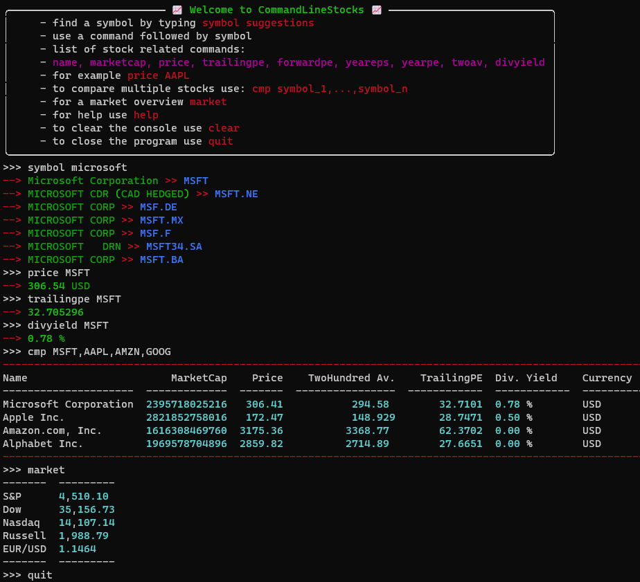

# CommandLineStocks
As we all know, comparing stocks is often an essential process when deciding where to invest our money. If we don't have an expensive tool like Bloomberg or something else, we have to open several tabs from Yahoo Finance or another website and jump back and forth to compare some key values of different stocks. This little tool aims to solve this problem by making it easier to access and compare raw data.

:heavy_exclamation_mark: To my regret, the underlying API is no longer available, I may try to switch to an alternative one. Hopefully the following pictures and source code can give a good impression of the project. Here you can see a snapshot on how the used API looked like: https://web.archive.org/web/20220408141905/https://www.yahoofinanceapi.com/ :heavy_exclamation_mark:

## how to install:
  - install needed packages
    - `pip install -r requirements.txt`
  - create an account at https://www.yahoofinanceapi.com/dashboard to get your `API TOKEN`
    - write the API TOKEN into `service/.env`
  - :heavy_exclamation_mark: run `python app.py` (I recommend adding an alias for more convenient use)
  - you can do 100 free requests a day

## how to use CommandLineStocks:
  - list of commands:
      - `help` to show all commands and instructions
      - `clear` to clear the terminal
      - `market` to get a market overview
      - `quit` to end the program
      - `symbol name`, finds the symbol for a given stockname, for example symbol Microsoft
      - `name symbol`, returns the companys name, for example name MSFT
      - `price symbol`, returns the current price
      - `marketcap symbol`, returns the companys valuation
      - `trailingpe symbol`, returns the P/E Ratio based on last 12 month
      - `forwardpe symbol`, returns the P/E Ratio based on estimated earning
      - `yeareps symbol`, returns yearly earnings per share
      -  `trailingeps symbol`, returns last twelve month earnings per share
      - `yearpe symbol`, returns yearly P/E Ratio
      - `twoav symbol`, returns the twohundred day average price 
      - `divyield symbol`, returns the dividend yield
      - `cmp symbol_1,...,symbol_n`, compares multiple stocks in a table
