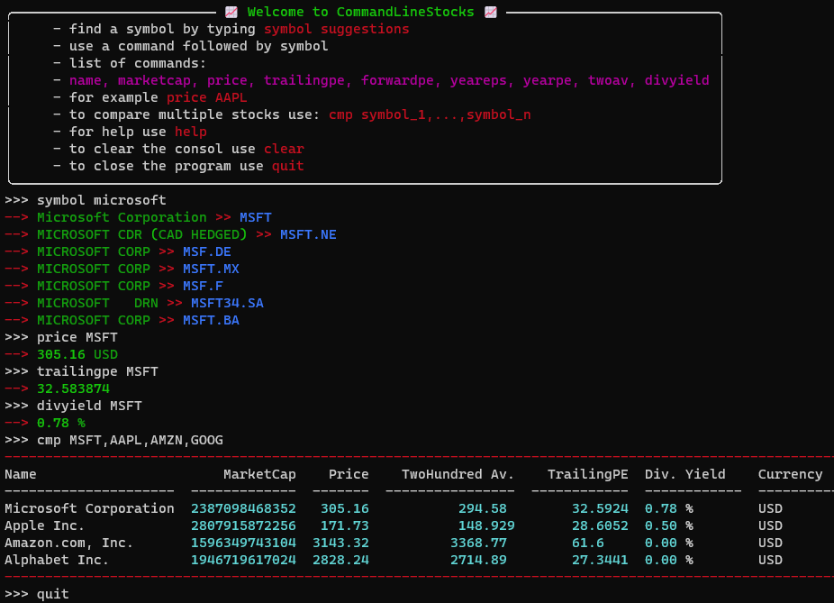

# Welcome to CommandLineStocks.

## how to install:
  - install needed packages
    - `pip install -r requirements.txt`
  - create an account at https://www.yahoofinanceapi.com/dashboard to get your `API TOKEN`
    - write the API TOKEN into `.env`
  - now you can do 100 free requests a day

## how to use CommandLineStocks:
  - there are two versions
  - RECOMMENDED: first version works python IDLE like, `run stock_idle.py`
  - second version works like a pure CMD tool, run `python stock_cl.py command symbol/name`
    - list of commands:
      - `symbol name, finds the symbol for a given stockname, for example symbol Microsoft`
      - `name symbol, returns the companys name, for example name MSFT`
      - `price symbol`
      - `marketcap symbol`
      - `trailingpe symbol`
      - `forwardpe symbol`
      - `yeareps symbol`
      - `yearpe symbol`
      - `twoav symbol`
      - `divyield symbol`
      - `cmp symbol_1,...,symbol_n`

## first version example

